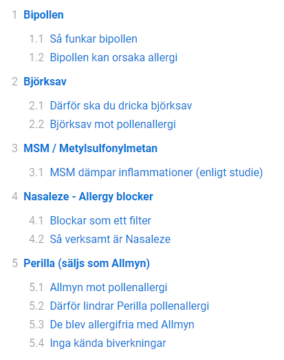

# PHP Table of Contents

*Version 1.2* - [Changelog](changelog.md)

## In short

- Convert html to a clickable table of contents
- Convert headings to support ID links
- Really small file
- Super simple usage

## Usage

```php
$toc = new PHPTableOfContents($html);

// Output the table of contents
echo $toc->list();

// Output the content
echo $toc->html();
```

## Result

Below is how a styled table of contents list may look like.



## Known limitations

- You can't provide an h1 in the `$html`. It will not know what to do with the h1.
- Don't add an ID tag to your headers because the will collide with IDs from Table of Contents IDs.
- Supports characters like åäöûè for ID generation but not chinese etc.

## Donate

Donate to [DevoneraAB](https://www.paypal.me/DevoneraAB) if you want.

## License

MIT